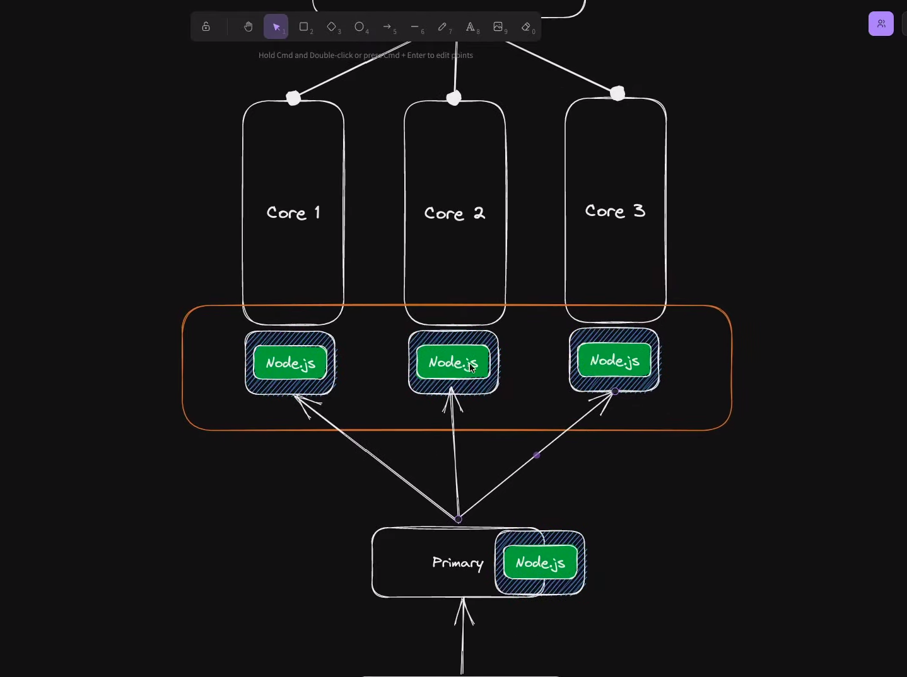

# Learn Redis

## 0. CLUSTER
``` bash
    redis-cli -c -p 7002
    
    docker exec -it redis-node-1 redis-cli --cluster create \
    redis-node-1:7001 \
    redis-node-2:7002 \
    redis-node-3:7003 \
    redis-node-4:7004 \
    redis-node-5:7005 \
    redis-node-6:7006 \
    --cluster-replicas 1
```

## 1. CONNECT REDIS
```bash
    redis-cli -h <host> -p <port>  -a  <password>
```

## 2. GLOBAL

```bash 
    # Search key
    keys 't*' 
```

## 3. STRING
```bash
    # Length 
    STRLEN name

    # Check
    object encoding str 

    # Embstring ( <= 44bytes) 
    SET name 0123456789012345678901234567890123456789abc

    # Raw ( > 44 bytes )
    SET name1 0123456789012345678901234567890123456789abcsdsdsdsdsdsdsdasdasdasdsd

    # Int 
    SET name2 10

    # TTL and handle key exit
    set lock_key_unique unique_value NX PX 10000
    TTL lock_key_unique

    # Count
    INCR like:product-001
    INCRBY like:product-001 5 
    DECR like:product-001
    DECRBY  like:product-001 5

    # Check exits
    EXISTS  block_user_id

    # Del
    DEL like:product-001
```

## 4. HASH

```bash
    # Add single and add multiple
    HSET cart:1 product1 2
    HSET cart:1 product2 1  product3 3  product4 1

    # Length count
    HLEN cart:1

    # Check exits
    HEXISTS cart:1 product3

    # Get only key
    HKEYS cart:1

    # Get all key and value 
    HGETALL cart:1 

    # Get detail key and value
    HGET cart:1 product2

    # DEL key 
    HDEL cart:1 product2

    # DEL ALL
    DEL cart:1
```

## 5 LIST
```bash
    # Add
    LPUSH order_history:user-001 "order_id_4"
    LINSERT order_history:user-001 before order_id_1 order_id_5
    LINSERT order_history:user-001 before order_id_4 order_id_6

    # Get all
    LRANGE order_history:user-001 0 -1

    # Get Detail flower index
    LINDEX order_history:user-001 0

    # Length 
    LLEN order_history:user-001

    # Exits
    EXISTS order_history:user-001

    # Del 
    LREM order_history:user-001 0 "order_id_1"

    # Advance
    lpush l:ticket ticket:01 
    blpop l:ticket 0
```

## 5 SET
```bash
    # Add
    SADD favorite_products:user-001 product1 product2 product3
    SADD favorite_products:user-002  product1 product5
    SADD favorite_products:user-003  product10 product5

    # Get all
    SMEMBERS favorite_products:user-001  

    # Get all count 
    SRANDMEMBER favorite_products:user-001 2

    # counter 
    SCARD favorite_products:user-001  

    # The common ground
    SINTER favorite_products:user-001 favorite_products:user-002 favorite_products:user-003
    SDIFF favorite_products:user-001 favorite_products:user-002 favorite_products:user-003

    # Get random 
    SRANDMEMBER favorite_products:user-001

    # The common ground and create key 
    SUNIONSTORE all_favorite_products favorite_products:user-001 favorite_products:user-002 favorite_products:user-003 

    # Not duplicate between all key 
    SUNION favorite_products:user-001 favorite_products:user-002 favorite_products:user-003   
    SUNION favorite_products:user-001 favorite_products:user-002 favorite_products:user-003 ... favorite_products:user-n 

    # Show data page
    SSCAN favorite_products:user-001 0 COUNT 10

    # Del key 
    SREM favorite_products:user-001 product2

    # Get and delete Random
    SPOP favorite_products:user-001
```

## 6 ZSET
```bash
    # Add
    ZADD sorted_favorite_products:user-001 1 "product3" 2 "product2" 3 "product1" 4 "product6" 5 "product5" 6 "product4" 

    # Get data sort ASC ( 1 2 3 )
    ZRANGE sorted_favorite_products:user-001 0 -1
    ZRANGE sorted_favorite_products:user-001 0 -1 WITHSCORES

    # Get data sort DESC ( 3 2 1 )
    ZREVRANGE sorted_favorite_products:user-001 0 -1
    ZREVRANGE sorted_favorite_products:user-001 0 -1 WITHSCORES

    # GET DETAIL
    ZSCORE sorted_favorite_products:user-001 "product2" 

    # GET is within approx ( Khoang) 
    ZRANGEBYSCORE sorted_favorite_products:user-001 2 4 
    ZCOUNT sorted_favorite_products:user-001 2 4 

    # Counter
    ZCARD sorted_favorite_products:user-001
    
    # Del
    ZREM sorted_favorite_products:user-001 "product3"
    DEL sorted_favorite_products:user-001
```

## 7 REDIS PUB/SUB
```bash
    # Pub
    PUBLISH user_tai_heo hello

    # Sub ( Single, multi )
    SUBSCRIBE user_tai_heo

    PSUBSCRIBE user.*
    PSUBSCRIBE .*user
    PSUBSCRIBE user*

```

## 8 REDIS Bitmaps and Bitfields
```bash
    SETBIT user:status 1002 0
    GETBIT user:status 1002 

```


## 9 STREAM
```bash
    # Pub
    XADD tickets * name "nguyen tien tai" seat "B12" movieId 53 sessonId 832
    xadd tickets * name "nguyen quoc hao" seat "B13" movieId 53 sessonId 832
    xadd tickets * name "dang thi ngoc tuyen" seat "B14" movieId 53 sessonId 832

    xlen tickets

    xread streams tickets 0-0

    xread block 60000 streams tickets $
    

    xrange tickets  1711081499957-0 1711081531247-0
    xrange tickets - + count 3
    xread streams  tickets 0

    xgroup create tickets officer_group $

    XREADGROUP GROUP officer_group consumer2 BLOCK 360000 STREAMS tickets >
```

## Loadtest
```bash
    # -n: request
    # -c: consistency
    loadtest -n 100 -c 10 http://localhost:5001/api/v2/redis/lock
```

## Check core Cluster Nodejs


```bash 
    lscpu
    cat /proc/cpuinfo | grep "processor" | wc -l
    cat /proc/cpuinfo | grep "core id" | sort | uniq | wc -l
```